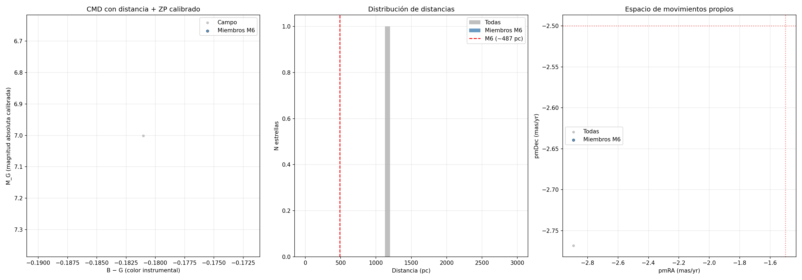

# Diagrama color-magnitud de M6 (Mariposa) con telescopio amateur

Construcción de un diagrama color-magnitud (CMD) del cúmulo abierto **M6** (NGC 6405, "la Mariposa") a partir de imágenes propias tomadas con una cámara monocromática y filtros RGB, calibrado con datos de **Gaia DR3** para obtener distancias individuales y filtrar miembros del cúmulo por movimiento propio.

El objetivo es reproducir, con equipo amateur, el tipo de diagrama Hertzsprung-Russell observacional que se usa en astrofísica estelar para visualizar la secuencia principal, identificar el *turn-off* y estudiar la población estelar de un cúmulo.

---

## Equipo utilizado

- **Telescopio**: William Optics GT81 (Grand Turismo 81), refractor apocromático de 81 mm de apertura y ~478 mm de focal (f/5.9).
- **Cámara**: ZWO ASI6200MM Pro (monocromática, sensor CMOS Sony IMX455 full-frame, 62 MP, 3.76 µm/píxel).
- **Filtros**: ZWO RGB de 2″ (filtros de astrofotografía, no fotométricos Johnson-Cousins).
- **Objetivo observado**: M6 (NGC 6405), cúmulo abierto en Escorpio.
  - Distancia: ~487 pc
  - Edad: ~95 millones de años
  - Declinación: −32° (muy favorable desde el hemisferio sur)

---

## Fundamento teórico

Un diagrama Hertzsprung-Russell relaciona **temperatura superficial** y **luminosidad** de las estrellas. Como ninguna de las dos se mide directamente desde un telescopio, se construye su versión observacional, el **diagrama color-magnitud (CMD)**:

- **Eje X**: índice de color (diferencia de magnitudes entre dos filtros). Proxy de la temperatura.
- **Eje Y**: magnitud (aparente o absoluta). Proxy de la luminosidad.

Para que un CMD se parezca al HR teórico, todas las estrellas graficadas deben estar **aproximadamente a la misma distancia**. Por eso se usan cúmulos estelares: sus estrellas nacieron juntas y están físicamente unidas a la misma distancia de nosotros.

---

## Proceso

### 1. Adquisición

Tomas separadas con cada filtro (B, G, R), incluyendo darks, flats y bias por filtro para calibración estándar de astrofotografía.

> 📷 *[Placeholder: screenshot del setup de captura / lista de exposiciones]*

### 2. Preprocesado en Siril

Calibración, registro y apilado de las series por filtro, obteniendo tres imágenes maestras: `B_master.fit`, `G_master.fit`, `R_master.fit`.

> 📷 *[Placeholder: screenshot del proceso de apilado en Siril]*

### 3. Fotometría de apertura

Detección de estrellas y ajuste PSF gaussiano en cada imagen maestra usando la herramienta **PSF dinámica** de Siril. Para cada estrella se obtiene:

- Coordenadas (RA, Dec, x, y)
- Magnitud instrumental (`Mag` = −2,5·log₁₀(flujo integrado))
- FWHMx, FWHMy (tamaño aparente)
- RMSE del ajuste

Resultado: tres CSV (`B.csv`, `G.csv`, `R.csv`) con una fila por estrella detectada.

> 📷 *[Placeholder: screenshot de PSF dinámica en Siril sobre M6]*

**Detecciones obtenidas:**

| Filtro | Estrellas |
|--------|-----------|
| B      | 224       |
| G      | 215       |
| R      | 264       |

### 4. Detección de problemas

La estrella más brillante (BM Sco, gigante naranja central, V≈5,8) resultó **saturada**. Indicios:

- Valor del píxel central = 1,0 (máximo normalizado en Siril → rango dinámico clipeado)
- FWHM ≈ 14″ contra ~5″ del resto (la estrella se "hincha" al saturar)

Las estrellas saturadas dan fotometría inservible porque los píxeles centrales no registran proporcionalmente la luz incidente.

> 📷 *[Placeholder: screenshot de la estrella saturada con su FWHM anormal]*

### 5. Procesado en Python

Un único script (`plot.py`) realiza:

1. **Carga** de los tres CSV.
2. **Limpieza**: descarta mediciones con RMSE alto y FWHM anormal (saturadas o ruido puntual).
3. **Cruce** entre los tres filtros por coordenadas (RA/Dec) usando `astropy.SkyCoord` con tolerancia de 3″.
4. **Consulta a Gaia DR3** por lotes de 20 estrellas (cross-match en el servidor con tabla temporal subida vía `TAP_UPLOAD`).
5. **Filtrado** por calidad de paralaje (S/N > 3) y por rango de distancia compatible con M6.
6. **Calibración** del punto cero de magnitud usando la magnitud G de Gaia como referencia.
7. **Identificación de miembros del cúmulo** por movimiento propio común.
8. **Generación de gráficos**: CMD, histograma de distancias y diagrama vector-punto.

Ver `plot.py` para el código completo.

### Dependencias

```bash
pip install pandas numpy matplotlib astropy astroquery
```

### Credenciales Gaia (opcional pero recomendado)

Cuenta gratuita: https://www.cosmos.esa.int/web/gaia-users/register

Forma segura usando `~/.netrc`:

```
machine gea.esac.esa.int
login tu_usuario
password tu_password
```

```bash
chmod 600 ~/.netrc
```

---

## Resultados

### Primera iteración: CMD instrumental sin corrección de distancia

200 estrellas con match en los tres filtros, graficando magnitud G instrumental vs. color B−G instrumental.


Se aprecia claramente la **secuencia principal** como una banda diagonal desde arriba-izquierda (estrellas azules brillantes) hacia abajo-derecha (estrellas más rojas y débiles). Los puntos dispersos a la derecha (B−G > 0) son candidatos a estrellas de campo no pertenecientes al cúmulo o gigantes evolucionadas.

### Segunda iteración: corrección con Gaia DR3

Tras consultar Gaia DR3 para cada una de las 200 estrellas y aplicar:

- Filtro de paralaje confiable (S/N > 3)
- Calibración de punto cero de magnitud
- Identificación de miembros por movimiento propio dentro del rango de distancia 350–700 pc



**Estado actual:** la calibración con Gaia reveló dificultades importantes. De 200 estrellas matcheadas, solo una fracción pequeña pasó el filtro de calidad de paralaje, sugiriendo que muchas de las detecciones podrían corresponder a estrellas lejanas del fondo galáctico (M6 está hacia el centro de la Galaxia, en una dirección densamente poblada) en vez de a miembros reales del cúmulo. Esto se explica porque las estrellas más brillantes de M6 (V≈6-9) saturaron en las exposiciones, dejando a las estrellas detectadas dominadas por fuentes más débiles que en muchos casos son objetos lejanos intrínsecamente más luminosos vistos en la misma dirección.

---

## Aprendizajes y limitaciones

**Lo que funcionó:**

- Pipeline completo de fotometría amateur a CMD funcional.
- La secuencia principal del cúmulo se aprecia claramente en el CMD instrumental.
- Cross-match con Gaia DR3 mediante upload de tabla local (mucho más rápido que queries individuales).

**Limitaciones identificadas:**

- **Filtros RGB no fotométricos**: el color instrumental no es directamente comparable con sistemas estándar (Johnson B−V, Sloan g−r). Para calibrar habría que usar estrellas de referencia de APASS y derivar coeficientes de transformación.
- **Rango dinámico**: para capturar tanto las estrellas brillantes (turn-off) como las débiles (secuencia principal baja) hacen falta dos series de exposiciones, cortas y largas.
- **Astrometría**: posibles sesgos sistemáticos en el plate-solve respecto al sistema ICRS de Gaia pueden afectar el cross-match.
- **Enrojecimiento interestelar**: M6 sufre extinción de E(B−V) ≈ 0,14 por polvo galáctico, que desplaza el CMD hacia la derecha.

---

## Próximos pasos

- [ ] Repetir la observación con una serie corta (1-2 s) específicamente para no saturar las brillantes del cúmulo.
- [ ] Calibrar las magnitudes instrumentales a sistema estándar usando estrellas de referencia de APASS.
- [ ] Probar otros índices de color (B−R, G−R) y comparar la nitidez de la secuencia principal.
- [ ] Ajustar una isócrona teórica (PARSEC, MIST) al *turn-off* para estimar edad y metalicidad de forma independiente.
- [ ] Repetir el experimento con un cúmulo más alto sobre el horizonte para reducir extinción atmosférica diferencial entre filtros.
- [ ] Investigar y corregir el problema de astrometría / profundidad que llevó a baja tasa de match con paralajes confiables en Gaia.

---

## Estructura del repositorio

```
.
├── README.md              # Este archivo
├── plot.py                # Script principal de procesado
├── B.csv                  # Fotometría Siril del filtro B
├── G.csv                  # Fotometría Siril del filtro G
├── R.csv                  # Fotometría Siril del filtro R
├── M6_CMD.png             # CMD instrumental inicial
└── M6_CMD_gaia.png        # CMD calibrado con Gaia DR3
```

---

## Referencias

- **Gaia DR3**: Gaia Collaboration et al. (2023), *A&A* 674, A1. https://www.cosmos.esa.int/gaia
- **Siril**: software libre de procesado astronómico. https://siril.org/
- **Astroquery**: Ginsburg et al. (2019), *AJ* 157, 98. https://astroquery.readthedocs.io/
- **M6 (NGC 6405)**: cúmulo abierto en Escorpio descubierto por Giovanni Battista Hodierna antes de 1654, catalogado por Charles Messier en 1764.

---

## Licencia

Datos y código bajo licencia abierta (especificar según preferencia del autor). Los datos de Gaia DR3 son propiedad de la ESA y se usan bajo sus términos de uso públicos.
